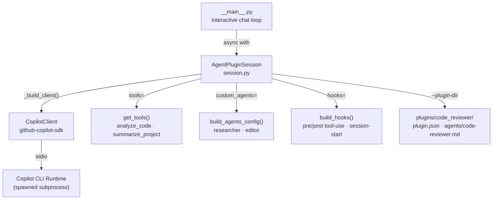

# sample-gh-copilot-sdk 0.1.0

[](LICENSE)
[](CHANGELOG.md)

> A Python reference application that shows how to extend GitHub Copilot with
> custom agents, registered tools, session hooks, and plugin directories using
> the `github-copilot-sdk`.

## Prerequisites

| Requirement | Version |
|---|---|
| Python | `>=3.14` |
| Poetry | `2.x` |
| GitHub Copilot access | Active subscription or trial |

After installing the Python package, download the Copilot CLI runtime once:

```bash
poetry run python -m copilot download-runtime
```

The runtime is cached locally and reused on subsequent runs.

## Installation

```bash
poetry install
```

## Usage

Start the interactive agent-plugins demo:

```bash
poetry run python -m sample_gh_copilot_sdk.agent_plugins
```

The demo:

1. Loads the bundled `code_reviewer` plugin directory via `--plugin-dir`.
2. Registers two custom agents (**researcher** and **editor**) and two custom
   tools (`analyze_code`, `summarize_project`).
3. Opens an interactive chat loop — type a prompt and press **Enter**.  
   Exit with **Ctrl+C** or **Ctrl+D**.

```
╔══════════════════════════════════════════════════════╗
║   GitHub Copilot — Agent Plugins Demo                ║
║   Custom agents: researcher · editor                 ║
║   Custom tools:  analyze_code · summarize_project    ║
╚══════════════════════════════════════════════════════╝
Plugin : …/plugins/code_reviewer
Model  : gpt-5-mini

You: Using the code-reviewer agent review the tools.py in this project.
Assistant: …
```

## Components / Architecture



### Module overview

| Module | Responsibility |
|---|---|
| `agent_plugins/__main__.py` | Interactive chat entry point (`python -m …`) |
| `agent_plugins/session.py` | `AgentPluginSession` — async context manager wiring all extensions |
| `agent_plugins/tools.py` | `@define_tool` definitions with Pydantic parameter models |
| `agent_plugins/agents.py` | `AgentConfig` TypedDict + researcher / editor builder functions |
| `agent_plugins/hooks.py` | Pre/post tool-use and session-start hook handlers |
| `agent_plugins/plugins/code_reviewer/` | Bundled plugin directory (manifest + agent definition) |

## Configuration

| Environment variable | Default | Description |
|---|---|---|
| `SAMPLE_GH_COPILOT_SDK_CONFIG_DIR` | *(bundled)* | Override the directory containing `logging.ini` |
| `COPILOT_CLI_PATH` | *(auto-downloaded)* | Use a specific Copilot CLI binary |
| `COPILOT_SKIP_CLI_DOWNLOAD` | `0` | Set to `1` to disable automatic runtime download |
| `COPILOT_PLUGIN_DIR_ONLY` | *(unset)* | Set to `true` to suppress ambient plugin discovery |

## Development

### Format and lint

```bash
poetry run black sample_gh_copilot_sdk
poetry run pylint sample_gh_copilot_sdk   # must score 10.00/10
```

### Run tests with coverage

```bash
poetry run pytest --cov=sample_gh_copilot_sdk tests --cov-report html
# minimum threshold: 80 %
```

## Changelog

See [CHANGELOG.md](CHANGELOG.md).

## License

This project is licensed under the [MIT License](LICENSE).

## Author

Ron Webb
