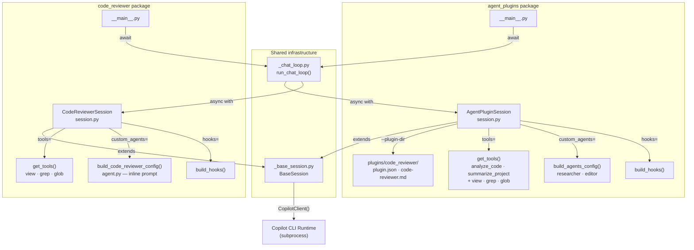

# sample-gh-copilot-sdk 0.1.0

[](LICENSE)
[](CHANGELOG.md)

> A Python reference application that shows how to extend GitHub Copilot with
> custom agents, registered tools, session hooks, and plugin directories using
> the `github-copilot-sdk`.  
> Two self-contained demos are included: one that loads agents via a **plugin
> directory**, and one that defines the agent **inline** in Python code.

## Prerequisites

| Requirement | Version |
|---|---|
| Python | `>=3.14` |
| Poetry | `2.x` |
| GitHub Copilot access | Active subscription or trial |

After installing the Python package, download the Copilot CLI runtime once:

```bash
poetry run python -m copilot download-runtime
```

The runtime is cached locally and reused on subsequent runs.

## Installation

```bash
poetry install
```

## Usage

### Demo 1 — Agent Plugins (plugin directory)

Loads the bundled `code_reviewer` plugin via `--plugin-dir`, registers
**researcher** and **editor** custom agents plus `analyze_code` /
`summarize_project` custom tools:

```bash
poetry run python -m sample_gh_copilot_sdk.agent_plugins
```

```
╔══════════════════════════════════════════════════════╗
║   GitHub Copilot — Agent Plugins Demo                ║
║   Custom agents: researcher · editor                 ║
║   Custom tools:  analyze_code · summarize_project    ║
╚══════════════════════════════════════════════════════╝
Plugin : …/plugins/code_reviewer
Model  : gpt-5-mini

You: Using the code-reviewer agent review the tools.py in this project.
Assistant: …
```

1. Loads the bundled `code_reviewer` plugin directory via `--plugin-dir`.
2. Registers two custom agents (**researcher** and **editor**) and two custom
   tools (`analyze_code`, `summarize_project`).
3. Opens an interactive chat loop — type a prompt and press **Enter**.  
   Exit with **Ctrl+C** or **Ctrl+D**.

### Demo 2 — Inline Code Reviewer (no plugin directory)

Defines the code-reviewer agent entirely in Python — no `.md` file or plugin
directory required:

```bash
poetry run python -m sample_gh_copilot_sdk.code_reviewer
```

```
╔══════════════════════════════════════════════════════╗
║   GitHub Copilot — Code Reviewer Demo (Inline)       ║
║   Agent:  code-reviewer (inline, no plugin dir)      ║
║   Tools:  view · grep · glob                         ║
╚══════════════════════════════════════════════════════╝
Model  : gpt-5-mini

You: Review the tools.py in this project.
Assistant: …
```

1. Registers the **code-reviewer** agent with its prompt embedded directly in
   `agent.py` (OWASP Top 10–aware review instructions).
2. Exposes read-only tools only: `view`, `grep`, `glob`.
3. Opens an interactive chat loop in the same way as Demo 1.

## Components / Architecture



### Module overview

| Module | Responsibility |
|---|---|
| `_base_session.py` | `BaseSession` — shared client lifecycle, content extraction, `run()` |
| `_chat_loop.py` | `run_chat_loop()` — shared interactive input/output loop |
| `agent_plugins/__main__.py` | Entry point for Demo 1 (`python -m …`) |
| `agent_plugins/session.py` | `AgentPluginSession(BaseSession)` — plugin-dir support, `_session_kwargs` |
| `agent_plugins/tools.py` | `build_review_tools()` + `analyze_code` / `summarize_project` tools |
| `agent_plugins/agents.py` | `AgentConfig` TypedDict + researcher / editor config builders |
| `agent_plugins/hooks.py` | Pre/post tool-use and session-start hook handlers |
| `agent_plugins/plugins/code_reviewer/` | Bundled plugin directory (manifest + agent `.md`) |
| `code_reviewer/__main__.py` | Entry point for Demo 2 (`python -m …`) |
| `code_reviewer/session.py` | `CodeReviewerSession(BaseSession)` — inline agent, `_session_kwargs` |
| `code_reviewer/agent.py` | `build_code_reviewer_config()` — OWASP-aware prompt embedded in Python |
| `code_reviewer/tools.py` | `get_tools()` — delegates to `build_review_tools()` for view/grep/glob |
| `code_reviewer/hooks.py` | Session-start hook; reuses pre/post handlers from `agent_plugins` |

## Configuration

| Environment variable | Default | Description |
|---|---|---|
| `SAMPLE_GH_COPILOT_SDK_CONFIG_DIR` | *(bundled)* | Override the directory containing `logging.ini` |
| `COPILOT_CLI_PATH` | *(auto-downloaded)* | Use a specific Copilot CLI binary |
| `COPILOT_SKIP_CLI_DOWNLOAD` | `0` | Set to `1` to disable automatic runtime download |
| `COPILOT_PLUGIN_DIR_ONLY` | *(unset)* | Set to `true` to suppress ambient plugin discovery |

## Development

### Format and lint

```bash
poetry run black sample_gh_copilot_sdk
poetry run pylint sample_gh_copilot_sdk   # must score 10.00/10
```

### Run tests with coverage

```bash
poetry run pytest --cov=sample_gh_copilot_sdk tests --cov-report html
# minimum threshold: 80 %
```

## Changelog

See [CHANGELOG.md](CHANGELOG.md).

## License

This project is licensed under the [MIT License](LICENSE).

## Author

Ron Webb
